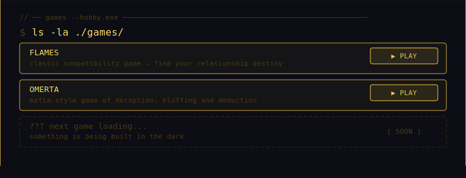
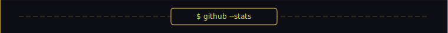

<!-- NAVEEN B — GitHub Profile README -->

<pre>
 ███╗   ██╗ █████╗ ██╗   ██╗███████╗███████╗███╗   ██╗
 ████╗  ██║██╔══██╗██║   ██║██╔════╝██╔════╝████╗  ██║
 ██╔██╗ ██║███████║██║   ██║█████╗  █████╗  ██╔██╗ ██║
 ██║╚██╗██║██╔══██║╚██╗ ██╔╝██╔══╝  ██╔══╝  ██║╚██╗██║
 ██║ ╚████║██║  ██║ ╚████╔╝ ███████╗███████╗██║ ╚████║
 ╚═╝  ╚═══╝╚═╝  ╚═╝  ╚═══╝  ╚══════╝╚══════╝╚═╝  ╚═══╝
</pre>

 

<!-- GitHub Stats — using github-readme-streak-stats (reliable) -->

<!-- Top Languages — using github-readme-stats (compact, gruvbox) -->
<!--  -->

 

<!-- Snake contribution graph via GitHub Actions workflow -->
<!-- Add this workflow to .github/workflows/snake.yml to auto-generate -->
<picture>
  <source media="(prefers-color-scheme: dark)" srcset="https://raw.githubusercontent.com/sir-zech/sir-zech/output/github-contribution-grid-snake-dark.svg"/>
  <source media="(prefers-color-scheme: light)" srcset="https://raw.githubusercontent.com/sir-zech/sir-zech/output/github-contribution-grid-snake.svg"/>
  
</picture>

 

<!-- ── CONNECT & PLAY FOOTER ───────────────────────────────────────────────── -->
<table width="760" style="border:1.5px solid #f5c842;border-radius:12px;border-collapse:separate;border-spacing:0;background:#0d0d16;font-family:'Courier New',monospace;margin-top:-2px"><tr><td style="padding:18px 24px 0">

// ── connect ─────────────────────────────────────────────────────────────────── 
<code style="color:#ffe066;font-size:13px">$ ping --me</code>

</td></tr><tr><td style="padding:8px 24px 0">

<!-- Contact Buttons -->
&nbsp;
&nbsp;

</td></tr><tr><td style="padding:16px 24px 0">

// ── games --play ────────────────────────────────────────────────────────────── 
<code style="color:#ffe066;font-size:13px">$ open ./games/</code>

</td></tr><tr><td style="padding:8px 24px 0">

<!-- Game Play Buttons -->
&nbsp;

</td></tr><tr><td style="padding:16px 24px 12px">

<!-- Profile Views Badge -->

  
$ exit &nbsp;//&nbsp; made with ♥ and too much coffee

</td></tr></table>

