<!-- ═══════════════════════════════════════════════════════════ -->
<!--              NAVEEN B — GITHUB PROFILE README             -->
<!-- ═══════════════════════════════════════════════════════════ -->

<pre>
 ███╗   ██╗ █████╗ ██╗   ██╗███████╗███████╗███╗   ██╗
 ████╗  ██║██╔══██╗██║   ██║██╔════╝██╔════╝████╗  ██║
 ██╔██╗ ██║███████║██║   ██║█████╗  █████╗  ██╔██╗ ██║
 ██║╚██╗██║██╔══██║╚██╗ ██╔╝██╔══╝  ██╔══╝  ██║╚██╗██║
 ██║ ╚████║██║  ██║ ╚████╔╝ ███████╗███████╗██║ ╚████║
 ╚═╝  ╚═══╝╚═╝  ╚═╝  ╚═══╝  ╚══════╝╚══════╝╚═╝  ╚═══╝
</pre>

### `[ FULL STACK DEVELOPER ]` · `[ CLOUD LEARNER ]` · `[ BUILDER ]`

 

---

<!-- ───────────────────── WHOAMI ───────────────────── -->

  

 

---

<!-- ───────────────────── TECH STACK ───────────────────── -->

  

 

---

<!-- ───────────────────── GAMES ───────────────────── -->

  

 

---

<!-- ───────────────────── GITHUB STATS ───────────────────── -->

  
    
  
  
    
  

 

---

<!-- ───────────────────── CONNECT ───────────────────── -->

  
    
  

<!-- Made with ♥ and too much coffee -->
