<!-- NAVEEN B — GitHub Profile README -->

<pre>
 ███╗   ██╗ █████╗ ██╗   ██╗███████╗███████╗███╗   ██╗
 ████╗  ██║██╔══██╗██║   ██║██╔════╝██╔════╝████╗  ██║
 ██╔██╗ ██║███████║██║   ██║█████╗  █████╗  ██╔██╗ ██║
 ██║╚██╗██║██╔══██║╚██╗ ██╔╝██╔══╝  ██╔══╝  ██║╚██╗██║
 ██║ ╚████║██║  ██║ ╚████╔╝ ███████╗███████╗██║ ╚████║
 ╚═╝  ╚═══╝╚═╝  ╚═╝  ╚═══╝  ╚══════╝╚══════╝╚═╝  ╚═══╝
</pre>

 

<!-- GitHub Stats — using github-readme-streak-stats (reliable) -->

<!-- Top Languages — using github-readme-stats (compact, gruvbox) -->

 

<!-- Snake contribution graph via GitHub Actions workflow -->
<!-- Add this workflow to .github/workflows/snake.yml to auto-generate -->
<picture>
  <source media="(prefers-color-scheme: dark)" srcset="https://raw.githubusercontent.com/sir-zech/sir-zech/output/github-contribution-grid-snake-dark.svg"/>
  <source media="(prefers-color-scheme: light)" srcset="https://raw.githubusercontent.com/sir-zech/sir-zech/output/github-contribution-grid-snake.svg"/>
  
</picture>

 

